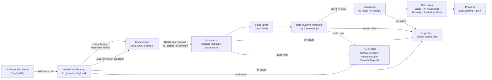
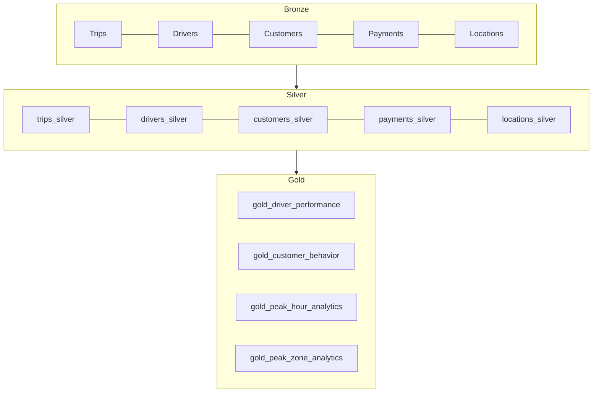

[Uploading README.md…]()
# Trip Transaction Analytics Platform

**Enterprise Azure Data Engineering project** — a production-grade, end-to-end
lakehouse platform built with Azure Data Factory, Azure Databricks, and Delta Lake,
processing daily trip transaction data from an on-premises SQL Server system into
analytics-ready Gold marts, with full monitoring, alerting, security, and CI/CD.

Designed to the standard expected at a Fortune 500 transportation/logistics
organization: incremental (not full-reload) processing, metadata-driven pipelines,
a reusable data quality framework, automated alerting, and governed, auditable data
movement from source to BI.

---

## 1. Architecture

### Component responsibilities
| Component | Responsibility |
|---|---|
| **SQL Server (on-prem)** | System of record for Trips, Drivers, Customers, Payments, Locations |
| **Self-Hosted Integration Runtime** | Secure bridge from Azure into the on-prem network |
| **Azure Data Factory** | Orchestration, watermark-driven incremental extraction, Bronze landing, DQ gate routing, failure handling |
| **ADLS Gen2** | Bronze (raw), Silver (cleansed), Gold (curated marts), Quarantine (rejected rows), Staging containers |
| **Azure Databricks + Delta Lake** | All transformation logic: cleansing, dedup, enrichment (Bronze->Silver), business aggregation (Silver->Gold), Delta Lake time travel/clone/schema evolution |
| **Data Quality Framework** | Rule-based validation, quarantine, quality scoring, pipeline gating |
| **Control DB (SQL Server)** | Watermarks, pipeline/notebook/DQ audit tables |
| **Logic Apps** | Email/Teams alerting on pipeline failure, job failure, or DQ score below threshold |
| **Power BI** | Star-schema semantic model over Gold, DAX measures, executive/driver/customer dashboards |
| **Azure DevOps** | Git-backed CI/CD across Dev/QA/UAT/Prod |
| **Unity Catalog / Key Vault / Managed Identity** | Governance, lineage, secrets, and access control across the whole platform |

### Data flow (Mermaid)



### Medallion layer detail (Mermaid)



---

## 2. Medallion Architecture Design

- **Bronze**: raw ingestion, schema preserved as-is from source, partitioned by
  `loaddate=YYYY-MM-DD`, incrementally loaded via the watermark pattern (see
  `ctl.WatermarkControl` in `SQL/03_control_and_audit_tables.sql`).
- **Silver**: see `Databricks/01_bronze_to_silver.py` — null handling, dedup via
  `row_number()` on the latest `ModifiedDate` per natural key, standardization
  (trimming/casing), business rules (e.g. dropoff >= pickup), audit columns
  (`_source_system`, `_ingestion_run_id`, `_load_date`, `_silver_processed_ts`).
- **Gold**: see `Databricks/02_silver_to_gold.py` for the three analytical marts
  (Driver Performance, Customer Behavior, Peak Hour Analytics) with full metric
  definitions and window-function-based ranking.

---

## 3. Folder Structure

```
Trip-Transaction-Analytics/
├── README.md                          <- this file
├── SQL/
│   ├── 01_source_ddl.sql              <- TripOpsDB DDL (Trips, Drivers, Customers, Payments, Locations)
│   ├── 02_sample_data_generator.sql   <- 60+ rows per dimension, 350 trips, 350 payments
│   └── 03_control_and_audit_tables.sql<- watermark + audit schema (TripOpsControlDB)
├── ADF/
│   ├── LinkedServices/                <- SQL Server, Key Vault, ADLS Gen2, Databricks
│   ├── Datasets/                      <- source, Bronze parquet, Silver delta, watermark
│   ├── Pipelines/                     <- PL_Raw_Data_Ingestion, PL_Incremental_Load, PL_Master_Orchestration, trigger
│   └── README_ADF_Conventions.md      <- naming, file layout, dynamic content reference
├── Databricks/
│   ├── 01_bronze_to_silver.py
│   ├── 02_silver_to_gold.py
│   └── 03_delta_lake_features.py
├── DeltaLake/
│   └── delta_lake_advanced_features.md
├── DataQuality/
│   └── dq_framework.py
├── LogicApps/
│   ├── logic_app_alerting_design.md
│   └── LA_TripAnalytics_Alerts_workflow.json
├── CI-CD/
│   └── cicd_strategy.md
├── Security/
│   └── security_and_governance.md
├── Performance/
│   └── performance_optimization.md
├── PowerBI/
│   └── powerbi_star_schema_and_dax.md
└── Documentation/
    └── interview_questions.md         <- 50 Q&A
```

---

## 4. Deployment Guide

1. **Provision infrastructure** (Bicep/ARM — see `CI-CD/cicd_strategy.md`): resource
   group, ADLS Gen2 (bronze/silver/gold/quarantine/staging containers), ADF, Databricks
   workspace, Key Vault, Logic App, control SQL database, Self-Hosted IR VM/service.
2. **Deploy source schema**: run `SQL/01_source_ddl.sql` then
   `SQL/02_sample_data_generator.sql` against the on-prem/dev SQL Server.
3. **Deploy control schema**: run `SQL/03_control_and_audit_tables.sql` against the
   control database.
4. **Configure ADF**: import `ADF/LinkedServices`, `ADF/Datasets`, `ADF/Pipelines`
   (via Git integration + ARM template deploy per `CI-CD/cicd_strategy.md`), populate
   Key Vault secrets referenced by linked services, register the Self-Hosted IR.
5. **Deploy Databricks assets**: push `Databricks/`, `DataQuality/` to Databricks Repos
   (or deploy via Databricks Asset Bundles), create the job cluster policy, register
   the Unity Catalog catalog/schemas (`trip_analytics.bronze/silver/gold/dev/archive`).
6. **Configure Logic App**: deploy `LogicApps/LA_TripAnalytics_Alerts_workflow.json`,
   connect the Office 365/Teams connectors, store the callback URL in Key Vault, wire
   it into ADF as a Global Parameter (`LogicAppAlertUrl`).
7. **Enable the trigger**: publish `ADF/Pipelines/Trigger_Daily_Schedule.json` to start
   the daily 01:00 UTC run of `PL_Master_Orchestration`.
8. **Connect Power BI**: point a semantic model at the Gold Delta tables (Databricks
   SQL Warehouse connector), build the star schema per `PowerBI/powerbi_star_schema_and_dax.md`.

## 5. Run instructions (manual/dev)
```bash
# 1. Source DB
sqlcmd -S <onprem-host> -i SQL/01_source_ddl.sql
sqlcmd -S <onprem-host> -i SQL/02_sample_data_generator.sql

# 2. Control DB
sqlcmd -S <control-host> -i SQL/03_control_and_audit_tables.sql

# 3. Trigger the master pipeline manually (Azure CLI)
az datafactory pipeline create-run \
  --factory-name adf-tripanalytics-dev \
  --resource-group rg-tripanalytics-dev \
  --name PL_Master_Orchestration
```

---

## 6. Expected outcomes
- Daily incremental ingestion of ~5 source tables in minutes, not hours.
- A quality-gated Gold layer that never publishes a mart below a 95% DQ score without
  alerting the on-call team first.
- Full lineage and audit trail from a single `RunId` across ADF, Databricks, and the
  control database.
- A portfolio-ready, interview-defensible reference implementation of the medallion
  architecture pattern used broadly across Fortune 500 data platforms.
